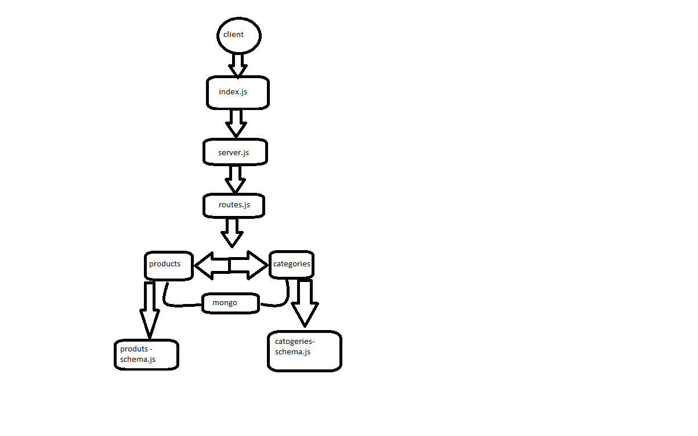

## Project: lab-15

### Author: Yazan Aljamal

### Links and Resources

* [submission PR]()

### Documentaion

## to run the application the show the data use this command

> nodemon

## swager link 

> https://app.swaggerhub.com/apis/yaljamal/api-server/0.1

## heruku link 

> 

### Setup

* install json-server (npm i json-server)
* install nodmone , express , jest , supertest , supergoose, morgan

## the routes of the app 

* GET ALL: GET - http://localhost:3030/api/v1/categories
* GET ONE: GET - http://localhost:3030/api/v1/categories/1
* UPDATE ONE: PUT - http://localhost:3030/api/v1/categories/1
* DELETE ONE: DELETE - http://localhost:3030/api/v1/categories/1
* GET ALL: GET - http://localhost:3030/api/v1/products
* GET ONE: GET - http://localhost:3030/api/v1/products/1
* UPDATE ONE: PUT - http://localhost:3030/api/v1/products/1
* DELETE ONE: DELETE - http://localhost:3030/api/v1/products/1

## Tests
Test:
 node index.js / nodemon / npm test / npm run lint

#### UML

